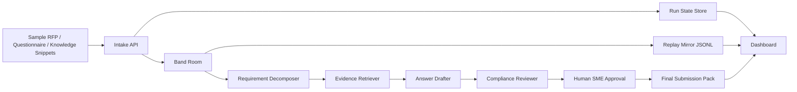

# RFP TrustRoom PRD v0.1

更新日期：2026-05-30

## 1. Executive Summary

### Problem Statement

B2B 团队响应 RFP、安全问卷和 vendor due diligence 时，信息分散在知识库、历史回答、安全政策、产品文档和 SME 经验里。售前、产品、安全、法务和交付团队需要反复沟通，容易出现证据过期、过度承诺、回答口径不一致和审批不可追溯的问题。

### Proposed Solution

RFP TrustRoom 是一个由 Band 协调的多 Agent 协作室。系统把 RFP / 安全问卷 / 公司知识片段导入同一个 Band room，由需求拆解、证据检索、答案起草、合规审查和人工 SME reviewer 协作生成可提交回答包、证据索引和可回放审计时间线。

### Success Criteria

- 评委在 60 秒内能看懂：这是 RFP / 安全问卷响应流程，不是通用 chatbot。
- Demo 中至少 3 个专职 Agent 通过 Band @mention、handoff、shared context 或 state update 协作。
- 样例 run 能处理至少 8 个 RFP / questionnaire item，并生成 draft answer、evidence source、risk level、review status。
- 100% 高风险或缺证据回答进入 human approval，不能自动进入 final submission pack。
- Live path 不稳定时，`reports/trustroom_replay.example.jsonl` 能在本地 5 秒内加载并回放同一条 timeline。

## 2. User Experience & Functionality

### User Personas

- **Sales Engineer / Solutions Consultant**：需要快速理解客户问题，组织内部证据，起草可信回答。
- **Security / Compliance Reviewer**：需要发现过度承诺、证据过期、缺少审批和高风险条款。
- **Product / SME Reviewer**：需要只处理真正需要人工判断的问题，而不是翻完整问卷。
- **Hackathon Judge**：需要在短时间内看见真实业务流程、Agent 分工、Band 协作和审计价值。

### User Stories

**Story 1: Intake**

As a sales engineer, I want to upload or select a sample RFP, security questionnaire, and company knowledge snippets so that the system can start a response workflow from concrete materials.

Acceptance Criteria:

- 用户可以选择内置 sample pack，不依赖真实客户数据。
- 每个 sample pack 至少包含 RFP markdown、questionnaire CSV/JSON、knowledge snippets JSON。
- 系统创建一个 run id，并展示当前状态为 `intake`。

**Story 2: Requirement Decomposition**

As a sales engineer, I want the system to break customer requirements into answerable items so that owners, risk level, and evidence needs are visible.

Acceptance Criteria:

- `requirement-decomposer-agent` 输出结构化 item list。
- 每个 item 包含 source reference、question text、category、risk level、required evidence type。
- Decomposer 的输出通过 Band handoff 给 Evidence Retriever。

**Story 3: Evidence Retrieval**

As a compliance reviewer, I want each answer to include evidence source and freshness so that unsupported or stale claims are caught early.

Acceptance Criteria:

- `evidence-retriever-agent` 为每个 item 生成 0 个或多个 evidence candidate。
- 每个 evidence candidate 包含 source title、quote/snippet、freshness label、confidence。
- 无证据或过期证据的 item 被标记为 `needs_review` 或 `blocked`。

**Story 4: Answer Drafting**

As a sales engineer, I want draft answers created from approved evidence so that I can prepare a submission faster without losing traceability.

Acceptance Criteria:

- `answer-drafter-agent` 生成 answer draft，并保留 evidence id 引用。
- 高风险 item 的 draft 不能直接进入 final pack。
- Draft 页面同时显示 answer、evidence、risk、status。

**Story 5: Review And Approval**

As a security or SME reviewer, I want high-risk answers routed to me so that the final pack does not contain unapproved promises.

Acceptance Criteria:

- `compliance-review-agent` 对每个 draft 输出 `approved`、`request_changes`、`blocked` 或 `needs_human_approval`。
- Human approver 可以 approve / request changes / reject。
- 未通过人审的高风险 item 不进入 final submission pack。

**Story 6: Audit Replay**

As a judge, I want to replay the workflow even if live APIs fail so that I can still evaluate the multi-agent collaboration.

Acceptance Criteria:

- Dashboard 可以从 JSONL replay 渲染 timeline。
- Replay 明确标注为 replay，不伪装成 live Band run。
- Timeline 展示 sender、receiver、task state、handoff、decision、risk、final pack event。

### Non-Goals

- 不做真实法律意见、合规认证、安全认证或正式投标决策。
- 不接入真实客户 RFP、真实 CRM、真实企业知识库或真实敏感材料。
- 不做完整 RFP management suite，例如权限矩阵、版本协同编辑、供应商门户或合同生命周期管理。
- 不承诺生产级 SLA、企业级审计合规、长期稳定运行。
- 不复刻 Codeband 或把项目做成通用 coding-agent 工具。

## 3. AI System Requirements

### Tool Requirements

- **Band / Band SDK**：核心协作层，用于 room、Agent identity、@mention routing、handoff、shared context、timeline evidence。
- **LLM provider / AI/ML API / mimo token plan**：用于文档理解、需求拆解、证据匹配、回答起草和审查摘要。
- **Local sample store**：保存 sample RFP、questionnaire、knowledge snippets、policy snippets。
- **Replay store**：JSONL 或 SQLite，镜像保存 run event，支持离线演示。
- **Dashboard**：展示 input、agent status、timeline、draft answers、evidence index、review state、final pack。

### Agent Responsibilities

- `trustroom-orchestrator`：创建 run / room，分派任务，维护状态机，汇总 final pack。
- `requirement-decomposer-agent`：把 RFP 和问卷拆成结构化 items。
- `evidence-retriever-agent`：为每个 item 匹配证据，标注来源、有效期和缺口。
- `answer-drafter-agent`：生成带证据引用的回答草稿。
- `compliance-review-agent`：检查过度承诺、证据不足、过期证据、合规风险和人审要求。
- `sme-approver`：人工审批高风险项，不作为自动 Agent 伪装。

### Evaluation Strategy

- **Fixture eval**：准备 2 套 sample pack，每套至少 8 个 question item。
- **Evidence coverage**：样例中至少 80% item 有 evidence candidate 或明确 `needs_review` 原因。
- **High-risk gate**：高风险 item 必须 100% 进入 human approval 或 blocked。
- **No-overclaim check**：回答中出现 production-ready、certified、fully compliant、guaranteed 等词时必须被 reviewer 标红或要求改写。
- **Replay parity**：同一 run 的 live timeline 和 replay timeline 必须展示相同的核心 handoff 与 final pack 状态。

## 4. Technical Specifications

### Architecture Overview

### Core Data Model

`Run`:

- `run_id`
- `mode`: `live` | `mock` | `replay`
- `state`: `intake` | `decomposition` | `evidence` | `drafting` | `review` | `approval` | `submission_pack`
- `created_at`
- `band_room_label`
- `current_blockers`

`QuestionItem`:

- `item_id`
- `source_ref`
- `question_text`
- `category`
- `risk_level`: `low` | `medium` | `high`
- `required_evidence_type`
- `status`

`EvidenceCandidate`:

- `evidence_id`
- `item_id`
- `source_title`
- `snippet`
- `freshness_label`: `current` | `stale` | `unknown`
- `confidence`

`AnswerDraft`:

- `answer_id`
- `item_id`
- `draft_text`
- `evidence_ids`
- `review_status`
- `review_notes`

`TimelineEvent`:

- `event_id`
- `run_id`
- `timestamp`
- `sender`
- `receiver`
- `event_type`
- `task_state`
- `payload_summary`
- `band_message_ref` 或脱敏 label

### Integration Points

- **Band live path**：开赛后接入真实 Band Remote Agents 和 room。
- **Mock path**：开赛前用本地事件和 agent runner 模拟完整流程。
- **Replay path**：从 `reports/trustroom_replay.example.jsonl` 回放，不依赖外部 API。
- **AI provider path**：优先把长文档理解、证据匹配、起草和 review 分配给 mimo token plan；Codex 主要承担代码实现和集成验证。

### Execution Resource Split

- **Codex Pro 约 60%**：主仓库架构、核心状态机、Band SDK 接入、dashboard、测试、部署、最终验收和提交清理。
- **Claude Code + mimo token plan 约 40%**：sample pack 生成、长文档解析 prompt、agent prompt 草案、fixture eval、局部开发调试、文案和 replay 数据生成。
- **边界**：所有进入主仓库的代码和文档必须经过 Codex 最终 review；Claude Code 产出的 replay、prompt 和模块要可复现、可测试、可删改。

### Security & Privacy

- `.env`、`agent_config.yaml`、API key、真实 room id、真实 agent key 不提交。
- Sample data 必须虚构或脱敏。
- Dashboard 默认不显示内部 UUID、API key、真实 trace id。
- Replay 明确标注为 replay，不能伪装成 live。
- 高风险回答不能绕过 human approval。

## 5. Risks & Roadmap

### Phased Rollout

**MVP: 开赛前到 2026-06-13**

- 完成 sample pack、mock run、状态机、dashboard skeleton。
- 生成 `reports/trustroom_replay.example.jsonl`。
- 至少 3 个 Agent 的 handoff 在 replay 中可见。

**v1.1: 2026-06-14 至 2026-06-16**

- 接入真实 Band live path。
- 加入 evidence freshness、risk gate、human approval。
- 完成 `docs/judge-10-minute-experience.md` 和 `docs/demo-runbook.md`。

**v2.0: 2026-06-17 至 2026-06-19**

- 部署 demo URL。
- 录制 5 分钟视频。
- 清理 public repo、README、license、submission copy。
- 固化 live path + replay fallback。

### Technical Risks

- **Band access kickoff 后才完全确认**：必须先做 mock / replay，避免等待官方 access。
- **LLM 输出不稳定**：所有关键输出都落到结构化 schema，并用 fixture eval 检查。
- **RFP 产品同质化**：demo 必须强调证据同源、Band handoff、冲突审查、人审和 replay，而不是普通自动问答。
- **资源额度变化**：6 月后 Codex Pro 额度变紧，复杂集成必须前置；mimo token plan 承担文档型任务。
- **公开提交风险**：提交前必须检查 secret、真实客户数据、真实 room id 和过度承诺文案。

### Open Questions

- 是否采用 FastAPI + server-rendered dashboard，还是 Next.js + Python agent runtime 分离。
- AI/ML API partner prize 是否要求直接使用 AI/ML API，而不是仅使用 mimo token plan。
- 正式提交仓库是把当前 private repo 切 public，还是创建脱敏 public submission repo。
