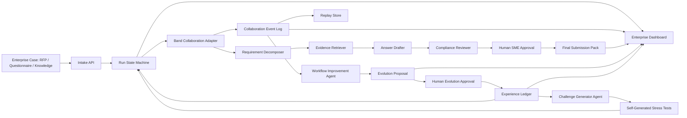

# RFP TrustRoom Enterprise Governed Evolution Design Spec

更新日期：2026-05-30

## 1. Purpose

RFP TrustRoom 的主线仍然是 Band of Agents Hackathon 的参赛项目：用 Band 协调多个专职 Agent，帮助企业售前、安全、产品和 SME 团队完成 RFP、安全问卷和 vendor due diligence 的证据同源响应流程。

本 spec 将项目从一个可行但偏薄的 MVP 升级为 **RFP TrustRoom with Governed Evolution**：系统不仅让 Agent 在 Band 中协作生成回答包，还会在每次 run 结束后分析协作 trace、review 结果和人工反馈，提出可审计、可评估、可回滚、必须经人工批准的流程改进建议。

一句话定位：

> RFP TrustRoom is a Band-coordinated RFP response room where specialized agents collaborate on answers, then review their own coordination trace to propose safe, human-approved workflow improvements for the next customer response.

### 1.1 Decision Summary

本设计选择 **Governed Evolution over Autonomous Self-Rewriting**。

要采纳的是自进化 Agent 的反馈循环、经验沉淀、自动压测和工作流调优思想；不采纳的是赛期内直接做源码自重写、模型微调、强化学习训练或不可控自动部署。这样可以把项目做厚，同时仍然服务官方赛题：让 Band 中的多 Agent 协作、审查、升级、决策和交接变得更可见。

核心产品承诺：

- 先完成 RFP / 安全问卷回答包，这是业务主路径。
- 再展示系统如何从一次协作 trace 中提出下一轮流程改进，这是原创亮点。
- 所有改进都以 proposal 形式出现，必须有人审、可评估、可回滚。
- live、mock、replay 使用同一种事件和经验模型，防止演示路径割裂。
- 第一屏优先回答企业用户关心的问题：哪些问题能提交、哪些缺证据、哪些需要人审、为什么可以信。

### 1.2 Source Material Triage

| 来源 | 采纳程度 | 采纳内容 | 不采纳内容 |
|---|---|---|---|
| MOSS | Concept only | 借鉴“Agent 可以提出代码/配置级改进”的想法 | 不做 live path 源码自重写，不让 Agent 直接改生产代码 |
| EvoAgentX | Strong inspiration | 借鉴自动构建、评估、优化多 Agent workflow 的闭环 | 不直接引入完整框架作为核心依赖，避免赛期集成风险 |
| Dr. Zero | Strong inspiration | 借鉴 data-free 自生成挑战题，用于生成 stress tests | 不实现 HRPO、RL 或训练流程 |
| OpenAI Cookbook | Strong inspiration | 借鉴产出、反馈、meta prompting、评估、部署的工程闭环 | 不做真实生产自动重训 |
| StuLife / ELL | Light inspiration | 借鉴 experience-driven lifelong learning，落成 ExperienceLedger | 不接入 benchmark 或模拟长期人生环境 |
| XMUDeepLIT survey | Framing | 用作分类与叙事框架：model-centric 到 environment-driven | 不把项目转成研究综述或 benchmark 项目 |

### 1.3 Enterprise User Frame

RFP TrustRoom 的真实用户不是“想看 Agent 很聪明的人”，而是正在被客户截止日期追着走的企业团队。产品体验必须围绕他们的工作对象、风险和决策来设计。

| Persona | Job To Be Done | Pain Today | TrustRoom Must Provide |
|---|---|---|---|
| Sales Engineer / Solutions Consultant | 在截止日前完成可信 RFP / 安全问卷回答 | 信息散落、反复问人、复制旧答案容易出错 | 问题清单、证据匹配、可提交草稿、阻塞项 |
| Security / Compliance Reviewer | 阻止过度承诺、过期证据和错误合规表述进入客户材料 | 审查太晚介入，缺少来源，风险隐藏在长文档里 | 风险队列、证据新鲜度、overclaim 标红、审批记录 |
| Product / SME Owner | 只处理真正需要专业判断的问题 | 被拉进整份问卷，无法快速定位需要自己拍板的项 | 精准 request changes / approve / reject，带上下文和证据 |
| Revenue / Proposal Lead | 知道这份包能不能按时提交 | 无法统一看进度、风险、责任人和最终材料状态 | Deal brief、进度、open blockers、final pack readiness |
| Enterprise IT / Security Buyer | 判断这个工具是否可控、可审计、不会泄露敏感信息 | 对 AI 自动写客户承诺不放心 | 人审 gate、审计 trail、脱敏、replay/live 区分、no-overclaim |

### 1.4 Enterprise Value Criteria

Demo 和实现都应当围绕下面的企业价值来取舍：

- **Time to first credible draft**：从 RFP / questionnaire 进入系统到得到带证据草稿的时间。
- **Evidence coverage**：有当前证据、过期证据、缺证据和需要 SME 判断的比例。
- **Risk containment**：高风险承诺、SLA、认证、合规声明是否全部进入人审或阻塞。
- **SME focus**：SME 只看到需要判断的 item，而不是整份问卷。
- **Auditability**：每个最终回答能追溯到问题、证据、审查、审批和 Agent handoff。
- **Workflow learning**：一次 run 暴露的问题能沉淀为受控经验，减少下一轮返工。

### 1.5 Enterprise Product Surface

第一屏不应先展示内部 Agent 日志，而应展示一个企业用户能立刻判断状态的工作台：

1. **Case Brief**：客户/样例名、截止时间、材料类型、当前模式 `mock | replay | live`。
2. **Submission Readiness**：ready / needs review / blocked 的 item 数量。
3. **Evidence Coverage**：current / stale / missing / conflicting evidence 的覆盖情况。
4. **Approval Queue**：等待 SME、安全或 evolution reviewer 处理的决策。
5. **Risk Flags**：overclaim、unsupported certification、SLA commitment、stale policy。
6. **Final Pack Preview**：可提交回答包、证据索引和未解决阻塞项。
7. **Collaboration Proof**：Band handoff / review / request changes 的可见摘要，而不是原始 UUID。

## 2. Hackathon Fit

官方赛题要求参赛者构建跨框架多 Agent 系统，至少 3 个 Agent 通过 Band 在 planning、execution、review、decision-making 或 task handoff 中协作。Band 必须是实际协作层，而不是最终通知系统或简单输出频道。

Governed Evolution 对四个评审维度的强化如下：

| 评审维度 | 原 RFP TrustRoom | Governed Evolution 增强 |
|---|---|---|
| Application of Technology | 多 Agent 通过 Band 分工、交接、审查 | Band 协作 trace 成为 evolution input；Agent 在 Band 中讨论改进建议、反驳和批准 |
| Presentation | 展示 RFP 回答包和审计时间线 | 展示一次 run 后系统如何发现协作薄弱点，并提出下一轮改进 |
| Business Value | 减少售前、合规、SME 来回协调 | 团队的 RFP 流程会沉淀经验，逐轮减少漏证据、过度承诺和审批返工 |
| Originality | 超越普通 chatbot / 单 Agent RAG | 从多 Agent workflow 升级为受治理的自进化企业流程 |

## 3. Design Principles

- **Band-first collaboration**：所有关键任务交接、review、veto、approval 和 evolution proposal 都必须能映射到 Band room 或 mirror event。
- **Enterprise-first surface**：UI、样本和文案先服务企业用户的提交判断，再服务评委的技术观察。
- **Governed, not autonomous mutation**：系统不允许 Agent 直接修改生产代码、secret、live Band 配置或公开提交材料。所有演化以 proposal 形式产生，必须经过 human approval。
- **Evidence before optimization**：任何改进建议必须引用具体 run event、question item、draft answer、review decision 或 human feedback。
- **Replay parity**：live、mock、replay 三种模式必须渲染同一种核心 timeline 和 evolution record，replay 不能伪装成 live。
- **No-overclaim boundary**：项目是 hackathon demo / working prototype，不声称生产部署、企业级合规、自动法律意见或长期稳定自进化。

## 4. Adopted Self-Evolving Ideas

### 4.1 Feedback-to-Workflow Evolution

借鉴 EvoAgentX 与工程化 feedback loop 思路，每个 TrustRoom run 结束后进入 `post_run_review` 阶段。系统收集：

- workflow timeline
- Agent handoff events
- unanswered or blocked question items
- stale or missing evidence
- compliance reviewer notes
- human approval decisions
- no-overclaim warnings
- final pack omissions

`workflow-improvement-agent` 读取这些信息后生成结构化 `EvolutionProposal`。proposal 可以建议：

- 修改 Agent prompt 中的 checklist
- 修改 task envelope 字段
- 增加 reviewer gate
- 调整 Agent routing order
- 增加 stress-test case
- 增加 overclaim detection phrase
- 将某类 high-risk item 默认进入 human approval

### 4.2 Governed Self-Evolution

借鉴 MOSS 的源码级自进化概念，但在 hackathon demo 中采用更安全的治理式实现：

- Agent 可以提出 prompt、workflow、task schema、routing rule 或 eval rule 的改进。
- Agent 不直接写入 live code path，不直接修改 `.env`、`agent_config.yaml`、API keys 或 Band credentials。
- 每个 proposal 必须进入 `pending_review`。
- Human approver 可以 `approve`、`request_changes`、`reject` 或 `defer`。
- 只有 `approved` proposal 会进入下一轮 mock/replay/live run 的 `active_lessons`。

这让自进化成为可展示的企业治理流程，而不是不可控自动改代码。

### 4.3 Self-Generated Stress Tests

借鉴 Dr. Zero 的 data-free 自生成任务思想，新增 `challenge-generator-agent`。它不需要人工标注数据，而是根据历史失败模式生成新的 RFP / security questionnaire 压测项。

生成的 stress tests 必须覆盖这些风险：

- 证据缺失
- 证据过期
- 客户诱导过度承诺
- 高风险 SLA
- 安全认证或合规声明边界
- 多问题共享同一证据导致引用冲突
- Answer Drafter 未保留 evidence id
- Compliance Reviewer 漏掉 human approval

Stress tests 不用于声称模型训练效果，只用于演示 TrustRoom 如何发现流程薄弱点。

### 4.4 Experience Ledger

借鉴 lifelong learning / experience-driven learning 思想，新增 `ExperienceLedger`。它保存经过批准的经验，而不是保存任意模型记忆。

ExperienceLedger 记录：

- accepted lessons
- rejected lessons with reason
- no-overclaim rules
- evidence freshness rules
- risk escalation rules
- recurring blocker patterns
- sample pack coverage notes
- human feedback summaries

每次 run 启动时，Orchestrator 会把适用 lessons 放入 run context，并在 dashboard 中显示“本轮使用了哪些历史经验”。这能让评委看到系统不是一次性脚本，而是在受控地积累组织经验。

## 5. System Architecture



### 5.1 Layers

| Layer | Responsibility | Depends On |
|---|---|---|
| Domain Core | Typed models for runs, items, evidence, drafts, reviews, approvals, final packs, proposals, lessons | Pydantic / standard Python |
| Workflow State Machine | Valid state transitions and final pack gating | Domain Core |
| Collaboration Adapter | Mock/replay/live Band-compatible interaction boundary | Domain Core, Event Log |
| Agent Runtime | Deterministic mock agents first; later LLM/Band remote agents | Domain Core, Adapter |
| Event Log / Replay Store | Append-only mirror of collaboration, decision and evolution events | Domain Core |
| Experience Ledger | Approved lessons and governance history | Event Log, Human Approval |
| Evaluation Harness | Readiness checks, stress tests, proposal validation | Domain Core, Replay Store |
| Dashboard | Enterprise-facing view of readiness, risk, approvals, final pack, Band collaboration and evolution | API, Replay Store |

### 5.2 Execution Modes

| Mode | Purpose | Band Dependency | Must Show | Must Not Claim |
|---|---|---|---|---|
| `mock` | deterministic local development before access is finalized | none | full workflow shape, agent roles, handoffs, risk gates, proposal generation | real Band collaboration |
| `replay` | stable judge fallback and video fallback | none | previously captured or authored event log, replay badge, same core timeline schema | live run, current room state |
| `live` | official hackathon evidence path | real Band account, room, remote agents | visible Band room or exported Band evidence, at least 3 agents, real handoff/review events | production reliability, enterprise compliance |

All three modes must write `TimelineEvent` records. Dashboard rendering must depend on the event schema, not on mode-specific UI branches. This keeps the demo honest and makes replay a fallback rather than a separate fake product.

### 5.3 Component Boundaries

| Component | Input | Output | Hard Boundary |
|---|---|---|---|
| `sample_loader` | fictional sample pack files | validated intake payload | never reads real customer files by default |
| `state_machine` | current run state, requested transition | accepted transition or explicit error | no Band calls, no LLM calls |
| `agent_runtime` | `TaskEnvelope`, current run context | `AgentResult`, `TimelineEvent[]` | no direct writes to final pack without state machine |
| `band_adapter` | room/message/event commands | normalized `TimelineEvent` mirror | no business logic, no secret exposure |
| `replay_store` | event records | ordered replay timeline | replay always labeled replay |
| `experience_ledger` | reviewed proposals | active/rejected lessons | no unreviewed lesson becomes active |
| `evaluation_harness` | run artifacts, proposals, stress tests | pass/fail report with reasons | never changes workflow state by itself |
| `dashboard` | API/read models | enterprise-facing pages and judge route | no secret, true room id, true agent key, or raw private trace |

### 5.4 Architecture Options Considered

**Option A: Thin MVP with replay timeline only**

This is fastest, but it risks looking like a scripted local demo. It proves basic workflow feasibility but does not create enough originality beyond ordinary multi-agent orchestration.

**Option B: Full self-evolving agent platform**

This is more novel, but too broad for the hackathon. Source rewriting, RL, automated deployment and benchmark claims would pull the project away from Band's core challenge and create safety/overclaim risk.

**Option C: RFP TrustRoom with Governed Evolution**

This is the selected option. It keeps RFP response as the concrete enterprise workflow, uses Band as the visible collaboration layer, and adds a governed post-run improvement loop that is useful, understandable and demoable within the build window.

## 6. Core Workflow

### 6.1 Normal RFP Run

1. Sales engineer selects a fictional enterprise case pack.
2. Orchestrator creates run and Band room label.
3. Orchestrator posts task context and @mentions Requirement Decomposer.
4. Requirement Decomposer outputs structured `QuestionItem` records.
5. Evidence Retriever attaches evidence candidates and freshness labels.
6. Answer Drafter generates draft answers with evidence ids.
7. Compliance Reviewer checks evidence gaps, stale evidence, overclaim language and high-risk promises.
8. Human SME Approver approves, rejects or requests changes for high-risk items.
9. Orchestrator builds final answer pack, evidence index, readiness summary and audit timeline.
10. Run enters `post_run_review`.

### 6.2 Governed Evolution Loop

1. `workflow-improvement-agent` reads the completed run timeline.
2. It identifies failure patterns and cites the exact supporting events.
3. It writes one or more `EvolutionProposal` records.
4. Proposals are shown in dashboard and posted to Band room or mirror timeline.
5. Human reviewer approves, rejects or requests changes.
6. Approved proposals become `ExperienceLesson` records.
7. Next run loads applicable lessons as run context.
8. Challenge Generator uses accepted lessons and failure patterns to create stress tests.
9. Evaluation Harness checks whether the new workflow handles the stress tests safely.

### 6.3 Failure Handling And Rollback

The system should fail closed:

- If evidence is missing, stale or conflicting, the affected answer moves to `needs_review` or `blocked`.
- If Compliance Reviewer flags overclaim language, the draft cannot enter final pack until revised or human-approved.
- If an evolution proposal lacks supporting event ids, it remains `pending_review` and cannot become a lesson.
- If a proposal would weaken human approval, no-overclaim rules or evidence requirements, the evaluation harness rejects it.
- If a previously accepted lesson causes a readiness check failure, it can be disabled by marking the lesson inactive and recording `rollback_note`.
- If live Band access fails, the run switches to mock or replay only with an explicit mode badge; it does not silently continue as live.

## 7. Agent Roles

### 7.1 Required Agents for MVP

| Agent | Role | Key Output |
|---|---|---|
| `trustroom-orchestrator` | Creates run, coordinates handoffs, maintains state, builds final pack | `Run`, `TimelineEvent`, `FinalSubmissionPack` |
| `requirement-decomposer-agent` | Breaks RFP/questionnaire into answerable items | `QuestionItem[]` |
| `evidence-retriever-agent` | Finds evidence candidates and marks freshness | `EvidenceCandidate[]` |
| `answer-drafter-agent` | Drafts answers grounded in evidence ids | `AnswerDraft[]` |
| `compliance-review-agent` | Detects overclaim, evidence gaps and human approval needs | `ReviewDecision[]` |
| `workflow-improvement-agent` | Proposes governed improvements after each run | `EvolutionProposal[]` |
| `challenge-generator-agent` | Generates synthetic stress tests from failure patterns | `StressTestCase[]` |

### 7.2 Human Roles

| Human Role | Responsibility |
|---|---|
| `sme-approver` | Approves or rejects high-risk final answers |
| `evolution-reviewer` | Approves, rejects or requests changes to evolution proposals |

Human roles are not disguised as autonomous agents. The UI must clearly mark human approvals.

## 8. Domain Model

### 8.0 CustomerCase

```yaml
CustomerCase:
  case_id: string
  case_name: string
  customer_profile: string
  deadline_label: string
  material_types: list[rfp | security_questionnaire | policy_snippets | prior_answers]
  business_goal: string
  submission_owner: string
  mode: live | mock | replay
```

### 8.1 Run

```yaml
Run:
  run_id: string
  case_id: string
  mode: live | mock | replay
  state: intake | triage | decomposition | evidence | drafting | review | approval | submission_pack | post_run_review | evolution_review
  created_at: datetime
  band_room_label: string
  active_lessons: list[string]
  current_blockers: list[string]
  readiness_summary: ready | needs_review | blocked
```

### 8.2 QuestionItem

```yaml
QuestionItem:
  item_id: string
  case_id: string
  source_ref: string
  question_text: string
  category: security | privacy | product | legal | support | commercial
  risk_level: low | medium | high
  required_evidence_type: policy | control | architecture | prior_answer | sme_attestation
  business_owner: sales | security | product | legal | sme
  status: open | evidence_ready | needs_review | blocked | approved
```

### 8.3 ApprovalDecision

```yaml
ApprovalDecision:
  decision_id: string
  item_id: string
  reviewer_role: sme-approver | security-reviewer | legal-reviewer | evolution-reviewer
  decision: approve | request_changes | reject | defer
  reason: string
  required_follow_up: string | null
  created_at: datetime
```

### 8.4 TimelineEvent

```yaml
TimelineEvent:
  event_id: string
  run_id: string
  timestamp: datetime
  sender: string
  receiver: string
  event_type: task_assigned | handoff | evidence_found | draft_created | review_decision | human_approval | final_pack_created | evolution_proposed | lesson_accepted | stress_test_generated
  task_state: string
  payload_summary: string
  related_object_ids: list[string]
  band_message_ref: string
  visibility: judge_view | technical_appendix
```

### 8.5 EvolutionProposal

```yaml
EvolutionProposal:
  proposal_id: string
  run_id: string
  proposed_by: workflow-improvement-agent
  proposal_type: prompt_change | routing_rule | task_schema_change | reviewer_gate | evidence_rule | stress_test | no_overclaim_rule
  target_component: string
  problem_statement: string
  supporting_event_ids: list[string]
  proposed_change: string
  expected_effect: string
  risk_level: low | medium | high
  evaluation_plan: string
  status: pending_review | approved | rejected | request_changes | deferred
  reviewer_notes: string
```

### 8.6 ExperienceLesson

```yaml
ExperienceLesson:
  lesson_id: string
  source_proposal_id: string
  accepted_at: datetime
  accepted_by: string
  scope: global | sample_pack | category | risk_level | agent_role
  lesson_type: checklist | routing_rule | evidence_rule | no_overclaim_rule | approval_policy | stress_test_seed
  instruction: string
  applies_when: string
  expires_at: datetime | null
  rollback_note: string
```

### 8.7 StressTestCase

```yaml
StressTestCase:
  case_id: string
  generated_from_lesson_ids: list[string]
  question_text: string
  category: string
  risk_hint: low | medium | high
  trap_type: missing_evidence | stale_evidence | overclaim | unsupported_certification | sla_commitment | conflicting_sources
  expected_safe_behavior: needs_review | needs_human_approval | blocked | request_changes
```

## 9. Governance Rules

1. High-risk answer drafts cannot enter final submission pack unless approved by human SME.
2. Evolution proposals cannot become active lessons unless approved by human evolution reviewer.
3. A proposal with `risk_level: high` can only affect mock/replay mode until reviewed again after a successful evaluation.
4. No Agent may write or expose API keys, real room ids, real agent keys, `.env`, or `agent_config.yaml`.
5. Dashboard must distinguish live, mock and replay.
6. Any proposal changing no-overclaim or approval policy must include supporting event ids.
7. Stress tests must be labeled synthetic.
8. Rejected proposals remain in the ledger with reviewer notes, because rejected lessons are useful audit evidence.

## 10. Evaluation

### 10.1 Readiness Checks

The readiness script should verify:

- one primary fictional enterprise sample pack loads successfully
- optional secondary sample packs are skipped unless present and valid
- the primary sample pack has at least 8 question items
- every item has category, risk level, required evidence type and business owner
- replay loads under 5 seconds
- at least 3 distinct agent roles appear in timeline
- at least one handoff crosses Agent boundaries
- at least one review loop routes an item back to evidence or drafting
- at least one high-risk item reaches human approval
- final pack excludes unapproved high-risk items
- dashboard data can render readiness, evidence coverage, risk queue and final pack preview
- at least one `EvolutionProposal` cites concrete timeline event ids
- approved lessons appear in ExperienceLedger
- stress tests cover at least 4 trap types
- no forbidden overclaim phrase appears in submission-facing copy

### 10.2 Proposal Evaluation

Before a proposal can become an active lesson, it must pass:

- **trace support check**：supporting events exist and belong to the same run
- **scope check**：proposal targets an allowed component
- **safety check**：proposal does not remove human approval or no-overclaim gates
- **stress test check**：generated or existing stress tests still route unsafe answers to review
- **presentation check**：proposal can be explained to a judge in one sentence

## 11. Dashboard Requirements

The dashboard should be enterprise-first, judge-readable. It should show seven sections:

1. **Case Brief**：sample customer, deadline, material summary, mode badge and submission owner.
2. **Submission Readiness**：ready / needs review / blocked item counts, plus top blockers.
3. **Evidence Coverage**：current, stale, missing and conflicting evidence grouped by question category.
4. **Risk & Approval Queue**：high-risk items, reviewer role, decision state and request-changes reason.
5. **Answer Pack**：draft answer, evidence id, review status, approval status and final-pack inclusion.
6. **Band Collaboration Timeline**：Agent sender, receiver, event type, handoff, review loop and state.
7. **Governed Evolution**：proposals, supporting events, reviewer decision, active lessons and stress tests.

The first viewport should make it obvious that the product is an RFP / security questionnaire workflow for enterprise teams, not a generic Agent dashboard. Raw room ids, agent keys, internal UUIDs and private logs belong only in a redacted technical appendix, not in the primary page.

## 12. Demo Story

The recommended 5-minute demo flow:

1. Show the enterprise problem: a sales team has a customer deadline, but evidence, reviewers and risk decisions are scattered.
2. Open the Case Brief and Submission Readiness view.
3. Start a TrustRoom run from the primary fictional sample materials.
4. Show at least 3 Agents collaborating through Band-style handoffs.
5. Show Evidence Retriever passing evidence to Answer Drafter and a stale/missing evidence item staying out of the final pack.
6. Show Compliance Reviewer blocking an unsupported or overclaiming draft and routing it back for rework.
7. Show Human SME approving or rejecting high-risk items from the approval queue.
8. Show final answer pack, evidence index, blockers and audit timeline.
9. Show Governed Evolution: the system notices a recurring weakness and proposes an approved playbook improvement.
10. Show the next synthetic stress test generated from that lesson.
11. End with boundaries: hackathon prototype, replay fallback available, no production or legal/compliance claim.

## 13. Implementation Scope

### 13.1 Must Have Before Kickoff

- Domain models for customer case, run, item, evidence, draft, review, approval, final pack, timeline event, proposal, lesson and stress test.
- One primary enterprise sample pack with realistic RFP / security questionnaire questions and evidence gaps.
- Mock collaboration path with at least 5 Agent roles, one review loop and human approval.
- Replay JSONL with full normal workflow, one blocked or reworked item, one governed evolution proposal and one accepted lesson.
- Dashboard view for readiness, evidence coverage, risk queue, final pack and evolution section.
- Readiness check for high-risk gating, proposal support and no-overclaim phrases.
- Secret-safe `.env.example` and no-secret check.

### 13.2 Must Have During Build Phase

- Band Remote Agent live path for at least 3 Agents.
- Live or recorded Band room evidence showing task handoff and review.
- Public-safe repository strategy.
- Demo URL.
- 5-minute video and judge runbook.

### 13.3 Should Have If Core Demo Is Stable

- AI/ML API usage for document understanding, evidence matching or review summarization.
- Challenge Generator producing additional stress tests from accepted lessons.
- Comparison view showing before/after effect of one accepted lesson.

### 13.4 Explicit Non-Goals

- No direct source-code self-rewriting in live path.
- No model fine-tuning, RL training or benchmark leaderboard claim.
- No real customer documents.
- No production deployment claim.
- No legal, compliance, security certification or automated bidding decision.
- No hidden conversion of replay output into a fake live demo.

### 13.5 Changes Required To Existing Implementation Plan

The current implementation plan should be revised before coding beyond T0:

1. Add `T0.5: Architecture and governance contracts`.
   - Commit this spec.
   - Update README/PRD references to describe Governed Evolution as a controlled post-run loop, not autonomous self-modification.

2. Split current `T1: Core contracts and state machine`.
   - `T1a: Enterprise domain contracts` for `CustomerCase`, RFP objects, approvals, `EvolutionProposal`, `ExperienceLesson`, `StressTestCase`, `TaskEnvelope`.
   - `T1b: Workflow state machine` with `triage`, `post_run_review` and `evolution_review`.
   - `T1c: Collaboration event schema` with mode-independent `TimelineEvent`.

3. Move Band adapter boundary earlier.
   - Create mock/replay adapter before sample data and dashboard work.
   - Delay only real `LiveBandAdapter` until official access is confirmed.

4. Expand sample/replay fixture requirements.
   - Primary sample pack should be a realistic enterprise case, not just toy rows.
   - Replay must include normal RFP workflow plus at least one rework loop, one evolution proposal, one human decision and one accepted lesson.
   - Stress test fixture must include at least four trap types.

5. Expand dashboard MVP.
   - Initial dashboard must lead with Case Brief, Submission Readiness, Evidence Coverage and Approval Queue.
   - It must include a Governed Evolution section, not only final answer pack.
   - Mode badges and replay honesty are required in the first dashboard version.

6. Move public/secret safety earlier.
   - Add `.env.example`, no-secret scan and public repo strategy before live Band work.
   - Do not push secrets, true room ids, true agent keys or private logs.

7. Add kickoff and submission-day Chrome review gates.
   - Kickoff gate: confirm official access, promo code, live Band constraints and X402 page ambiguity.
   - Submission gate: re-check deadline, required fields, prize/partner terms and submission format.

### 13.6 Acceptance Criteria For This Spec

This architecture is ready for implementation planning when all of the following are true:

- The main demo can still be explained as RFP / security questionnaire response in one sentence.
- An enterprise user can tell within 60 seconds which answers are ready, which are risky and who must approve them.
- At least 3 agent roles collaborate through Band or Band-compatible event mirrors.
- Governed Evolution is visible in the timeline and dashboard.
- No proposal becomes active without human approval.
- The replay path demonstrates the same core workflow as live, with clear labeling.
- The implementation plan has been updated so each new domain object and workflow state has tests.

## 14. References

- Band of Agents Hackathon official page: https://lablab.ai/ai-hackathons/band-of-agents-hackathon
- MOSS: https://arxiv.org/abs/2605.22794
- EvoAgentX: https://github.com/EvoAgentX/EvoAgentX
- Dr. Zero: https://arxiv.org/abs/2601.07055
- OpenAI Cookbook autonomous agent retraining: https://cookbook.openai.com/examples/partners/self_evolving_agents/autonomous_agent_retraining
- StuLife / ELL: https://github.com/ECNU-ICALK/ELL-StuLife
- Local material: `/Users/junhaocheng/self-evolving-agents-material.md`

## 15. Spec Self-Review

- **Placeholder scan**：本 spec 不包含未决实现占位或空白章节。
- **Scope check**：本 spec 聚焦 RFP TrustRoom 的受治理自进化层，不扩展成通用自进化 Agent 平台。
- **Enterprise fit**：本 spec 以售前、安全、产品、SME 和企业 IT 的提交判断、证据信任和人审控制为核心。
- **Safety check**：所有自进化能力均通过 proposal、human approval、evaluation 和 rollback 边界约束。
- **Hackathon fit**：设计保持 Band 作为核心协作层，并让协作 trace 成为演化依据。
- **No-overclaim check**：本 spec 明确限定为 hackathon demo / working prototype，不声称生产级合规或长期稳定运行。
