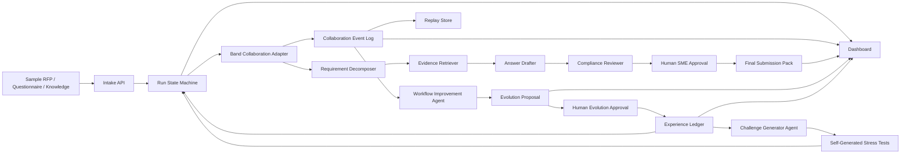

# RFP TrustRoom Governed Evolution Design Spec

更新日期：2026-05-30

## 1. Purpose

RFP TrustRoom 的主线仍然是 Band of Agents Hackathon 的参赛项目：用 Band 协调多个专职 Agent，完成 RFP、安全问卷和 vendor due diligence 的证据同源响应流程。

本 spec 将项目从一个可行但偏薄的 MVP 升级为 **RFP TrustRoom with Governed Evolution**：系统不仅让 Agent 在 Band 中协作生成回答包，还会在每次 run 结束后分析协作 trace、review 结果和人工反馈，提出可审计、可评估、可回滚、必须经人工批准的流程改进建议。

一句话定位：

> RFP TrustRoom is a Band-coordinated RFP response room where specialized agents collaborate on answers, then review their own coordination trace to propose safe, human-approved workflow improvements for the next customer response.

## 2. Hackathon Fit

官方赛题要求参赛者构建跨框架多 Agent 系统，至少 3 个 Agent 通过 Band 在 planning、execution、review、decision-making 或 task handoff 中协作。Band 必须是实际协作层，而不是最终通知系统或简单输出频道。

Governed Evolution 对四个评审维度的强化如下：

| 评审维度 | 原 RFP TrustRoom | Governed Evolution 增强 |
|---|---|---|
| Application of Technology | 多 Agent 通过 Band 分工、交接、审查 | Band 协作 trace 成为 evolution input；Agent 在 Band 中讨论改进建议、反驳和批准 |
| Presentation | 展示 RFP 回答包和审计时间线 | 展示一次 run 后系统如何发现协作薄弱点，并提出下一轮改进 |
| Business Value | 减少售前、合规、SME 来回协调 | 团队的 RFP 流程会沉淀经验，逐轮减少漏证据、过度承诺和审批返工 |
| Originality | 超越普通 chatbot / 单 Agent RAG | 从多 Agent workflow 升级为受治理的自进化企业流程 |

## 3. Design Principles

- **Band-first collaboration**：所有关键任务交接、review、veto、approval 和 evolution proposal 都必须能映射到 Band room 或 mirror event。
- **Governed, not autonomous mutation**：系统不允许 Agent 直接修改生产代码、secret、live Band 配置或公开提交材料。所有演化以 proposal 形式产生，必须经过 human approval。
- **Evidence before optimization**：任何改进建议必须引用具体 run event、question item、draft answer、review decision 或 human feedback。
- **Replay parity**：live、mock、replay 三种模式必须渲染同一种核心 timeline 和 evolution record，replay 不能伪装成 live。
- **No-overclaim boundary**：项目是 hackathon demo / working prototype，不声称生产部署、企业级合规、自动法律意见或长期稳定自进化。

## 4. Adopted Self-Evolving Ideas

### 4.1 Feedback-to-Workflow Evolution

借鉴 EvoAgentX 与工程化 feedback loop 思路，每个 TrustRoom run 结束后进入 `post_run_review` 阶段。系统收集：

- workflow timeline
- Agent handoff events
- unanswered or blocked question items
- stale or missing evidence
- compliance reviewer notes
- human approval decisions
- no-overclaim warnings
- final pack omissions

`workflow-improvement-agent` 读取这些信息后生成结构化 `EvolutionProposal`。proposal 可以建议：

- 修改 Agent prompt 中的 checklist
- 修改 task envelope 字段
- 增加 reviewer gate
- 调整 Agent routing order
- 增加 stress-test case
- 增加 overclaim detection phrase
- 将某类 high-risk item 默认进入 human approval

### 4.2 Governed Self-Evolution

借鉴 MOSS 的源码级自进化概念，但在 hackathon demo 中采用更安全的治理式实现：

- Agent 可以提出 prompt、workflow、task schema、routing rule 或 eval rule 的改进。
- Agent 不直接写入 live code path，不直接修改 `.env`、`agent_config.yaml`、API keys 或 Band credentials。
- 每个 proposal 必须进入 `pending_review`。
- Human approver 可以 `approve`、`request_changes`、`reject` 或 `defer`。
- 只有 `approved` proposal 会进入下一轮 mock/replay/live run 的 `active_lessons`。

这让自进化成为可展示的企业治理流程，而不是不可控自动改代码。

### 4.3 Self-Generated Stress Tests

借鉴 Dr. Zero 的 data-free 自生成任务思想，新增 `challenge-generator-agent`。它不需要人工标注数据，而是根据历史失败模式生成新的 RFP / security questionnaire 压测项。

生成的 stress tests 必须覆盖这些风险：

- 证据缺失
- 证据过期
- 客户诱导过度承诺
- 高风险 SLA
- 安全认证或合规声明边界
- 多问题共享同一证据导致引用冲突
- Answer Drafter 未保留 evidence id
- Compliance Reviewer 漏掉 human approval

Stress tests 不用于声称模型训练效果，只用于演示 TrustRoom 如何发现流程薄弱点。

### 4.4 Experience Ledger

借鉴 lifelong learning / experience-driven learning 思想，新增 `ExperienceLedger`。它保存经过批准的经验，而不是保存任意模型记忆。

ExperienceLedger 记录：

- accepted lessons
- rejected lessons with reason
- no-overclaim rules
- evidence freshness rules
- risk escalation rules
- recurring blocker patterns
- sample pack coverage notes
- human feedback summaries

每次 run 启动时，Orchestrator 会把适用 lessons 放入 run context，并在 dashboard 中显示“本轮使用了哪些历史经验”。这能让评委看到系统不是一次性脚本，而是在受控地积累组织经验。

## 5. System Architecture



### 5.1 Layers

| Layer | Responsibility | Depends On |
|---|---|---|
| Domain Core | Typed models for runs, items, evidence, drafts, reviews, approvals, final packs, proposals, lessons | Pydantic / standard Python |
| Workflow State Machine | Valid state transitions and final pack gating | Domain Core |
| Collaboration Adapter | Mock/replay/live Band-compatible interaction boundary | Domain Core, Event Log |
| Agent Runtime | Deterministic mock agents first; later LLM/Band remote agents | Domain Core, Adapter |
| Event Log / Replay Store | Append-only mirror of collaboration, decision and evolution events | Domain Core |
| Experience Ledger | Approved lessons and governance history | Event Log, Human Approval |
| Evaluation Harness | Readiness checks, stress tests, proposal validation | Domain Core, Replay Store |
| Dashboard | Judge-facing view of business flow, Band collaboration, evolution and evidence | API, Replay Store |

## 6. Core Workflow

### 6.1 Normal RFP Run

1. User selects a fictional sample pack.
2. Orchestrator creates run and Band room label.
3. Orchestrator posts task context and @mentions Requirement Decomposer.
4. Requirement Decomposer outputs structured `QuestionItem` records.
5. Evidence Retriever attaches evidence candidates and freshness labels.
6. Answer Drafter generates draft answers with evidence ids.
7. Compliance Reviewer checks evidence gaps, stale evidence, overclaim language and high-risk promises.
8. Human SME Approver approves, rejects or requests changes for high-risk items.
9. Orchestrator builds final answer pack, evidence index and audit timeline.
10. Run enters `post_run_review`.

### 6.2 Governed Evolution Loop

1. `workflow-improvement-agent` reads the completed run timeline.
2. It identifies failure patterns and cites the exact supporting events.
3. It writes one or more `EvolutionProposal` records.
4. Proposals are shown in dashboard and posted to Band room or mirror timeline.
5. Human reviewer approves, rejects or requests changes.
6. Approved proposals become `ExperienceLesson` records.
7. Next run loads applicable lessons as run context.
8. Challenge Generator uses accepted lessons and failure patterns to create stress tests.
9. Evaluation Harness checks whether the new workflow handles the stress tests safely.

## 7. Agent Roles

### 7.1 Required Agents for MVP

| Agent | Role | Key Output |
|---|---|---|
| `trustroom-orchestrator` | Creates run, coordinates handoffs, maintains state, builds final pack | `Run`, `TimelineEvent`, `FinalSubmissionPack` |
| `requirement-decomposer-agent` | Breaks RFP/questionnaire into answerable items | `QuestionItem[]` |
| `evidence-retriever-agent` | Finds evidence candidates and marks freshness | `EvidenceCandidate[]` |
| `answer-drafter-agent` | Drafts answers grounded in evidence ids | `AnswerDraft[]` |
| `compliance-review-agent` | Detects overclaim, evidence gaps and human approval needs | `ReviewDecision[]` |
| `workflow-improvement-agent` | Proposes governed improvements after each run | `EvolutionProposal[]` |
| `challenge-generator-agent` | Generates synthetic stress tests from failure patterns | `StressTestCase[]` |

### 7.2 Human Roles

| Human Role | Responsibility |
|---|---|
| `sme-approver` | Approves or rejects high-risk final answers |
| `evolution-reviewer` | Approves, rejects or requests changes to evolution proposals |

Human roles are not disguised as autonomous agents. The UI must clearly mark human approvals.

## 8. Domain Model

### 8.1 Run

```yaml
Run:
  run_id: string
  mode: live | mock | replay
  state: intake | decomposition | evidence | drafting | review | approval | submission_pack | post_run_review | evolution_review
  created_at: datetime
  band_room_label: string
  active_lessons: list[string]
  current_blockers: list[string]
```

### 8.2 TimelineEvent

```yaml
TimelineEvent:
  event_id: string
  run_id: string
  timestamp: datetime
  sender: string
  receiver: string
  event_type: task_assigned | handoff | evidence_found | draft_created | review_decision | human_approval | final_pack_created | evolution_proposed | lesson_accepted | stress_test_generated
  task_state: string
  payload_summary: string
  related_object_ids: list[string]
  band_message_ref: string
  visibility: judge_view | technical_appendix
```

### 8.3 EvolutionProposal

```yaml
EvolutionProposal:
  proposal_id: string
  run_id: string
  proposed_by: workflow-improvement-agent
  proposal_type: prompt_change | routing_rule | task_schema_change | reviewer_gate | evidence_rule | stress_test | no_overclaim_rule
  target_component: string
  problem_statement: string
  supporting_event_ids: list[string]
  proposed_change: string
  expected_effect: string
  risk_level: low | medium | high
  evaluation_plan: string
  status: pending_review | approved | rejected | request_changes | deferred
  reviewer_notes: string
```

### 8.4 ExperienceLesson

```yaml
ExperienceLesson:
  lesson_id: string
  source_proposal_id: string
  accepted_at: datetime
  accepted_by: string
  scope: global | sample_pack | category | risk_level | agent_role
  lesson_type: checklist | routing_rule | evidence_rule | no_overclaim_rule | approval_policy | stress_test_seed
  instruction: string
  applies_when: string
  expires_at: datetime | null
  rollback_note: string
```

### 8.5 StressTestCase

```yaml
StressTestCase:
  case_id: string
  generated_from_lesson_ids: list[string]
  question_text: string
  category: string
  risk_hint: low | medium | high
  trap_type: missing_evidence | stale_evidence | overclaim | unsupported_certification | sla_commitment | conflicting_sources
  expected_safe_behavior: needs_review | needs_human_approval | blocked | request_changes
```

## 9. Governance Rules

1. High-risk answer drafts cannot enter final submission pack unless approved by human SME.
2. Evolution proposals cannot become active lessons unless approved by human evolution reviewer.
3. A proposal with `risk_level: high` can only affect mock/replay mode until reviewed again after a successful evaluation.
4. No Agent may write or expose API keys, real room ids, real agent keys, `.env`, or `agent_config.yaml`.
5. Dashboard must distinguish live, mock and replay.
6. Any proposal changing no-overclaim or approval policy must include supporting event ids.
7. Stress tests must be labeled synthetic.
8. Rejected proposals remain in the ledger with reviewer notes, because rejected lessons are useful audit evidence.

## 10. Evaluation

### 10.1 Readiness Checks

The readiness script should verify:

- two fictional sample packs load successfully
- each sample pack has at least 8 question items
- replay loads under 5 seconds
- at least 3 distinct agent roles appear in timeline
- at least one handoff crosses Agent boundaries
- at least one high-risk item reaches human approval
- final pack excludes unapproved high-risk items
- at least one `EvolutionProposal` cites concrete timeline event ids
- approved lessons appear in ExperienceLedger
- stress tests cover at least 4 trap types
- no forbidden overclaim phrase appears in submission-facing copy

### 10.2 Proposal Evaluation

Before a proposal can become an active lesson, it must pass:

- **trace support check**：supporting events exist and belong to the same run
- **scope check**：proposal targets an allowed component
- **safety check**：proposal does not remove human approval or no-overclaim gates
- **stress test check**：generated or existing stress tests still route unsafe answers to review
- **presentation check**：proposal can be explained to a judge in one sentence

## 11. Dashboard Requirements

The dashboard should show six judge-facing sections:

1. **Case Intake**：sample RFP / questionnaire summary and mode badge.
2. **Band Collaboration Timeline**：Agent sender, receiver, event type, handoff and state.
3. **Answer Pack**：draft answer, evidence id, review status and approval status.
4. **Risk & Approval Board**：high-risk items, missing evidence, stale evidence and human decisions.
5. **Governed Evolution**：proposals, supporting events, reviewer decision and active lessons.
6. **Replay / Live Evidence**：clear label showing whether the run is live, mock or replay.

The first viewport should make it obvious that the product is an RFP / security questionnaire workflow, not a generic Agent dashboard.

## 12. Demo Story

The recommended 5-minute demo flow:

1. Show the business problem: RFP and security questionnaire answers often require sales, security, legal and SME coordination.
2. Start a TrustRoom run from fictional sample materials.
3. Show at least 3 Agents collaborating through Band-style handoffs.
4. Show Evidence Retriever passing evidence to Answer Drafter.
5. Show Compliance Reviewer blocking an unsupported or overclaiming draft.
6. Show Human SME approving or rejecting high-risk items.
7. Show final answer pack and evidence index.
8. Show Governed Evolution: the system notices a recurring weakness and proposes an approved improvement.
9. Show the next synthetic stress test generated from that lesson.
10. End with boundaries: hackathon prototype, replay fallback available, no production or legal/compliance claim.

## 13. Implementation Scope

### 13.1 Must Have Before Kickoff

- Domain models for run, item, evidence, draft, review, final pack, timeline event, proposal, lesson and stress test.
- Mock collaboration path with at least 5 Agent roles and human approval.
- Replay JSONL with full normal workflow and one governed evolution proposal.
- Dashboard view for normal workflow and evolution section.
- Readiness check for high-risk gating, proposal support and no-overclaim phrases.
- Secret-safe `.env.example` and no-secret check.

### 13.2 Must Have During Build Phase

- Band Remote Agent live path for at least 3 Agents.
- Live or recorded Band room evidence showing task handoff and review.
- Public-safe repository strategy.
- Demo URL.
- 5-minute video and judge runbook.

### 13.3 Should Have If Core Demo Is Stable

- AI/ML API usage for document understanding, evidence matching or review summarization.
- Challenge Generator producing additional stress tests from accepted lessons.
- Comparison view showing before/after effect of one accepted lesson.

### 13.4 Explicit Non-Goals

- No direct source-code self-rewriting in live path.
- No model fine-tuning, RL training or benchmark leaderboard claim.
- No real customer documents.
- No production deployment claim.
- No legal, compliance, security certification or automated bidding decision.
- No hidden conversion of replay output into a fake live demo.

## 14. References

- Band of Agents Hackathon official page: https://lablab.ai/ai-hackathons/band-of-agents-hackathon
- MOSS: https://arxiv.org/abs/2605.22794
- EvoAgentX: https://github.com/EvoAgentX/EvoAgentX
- Dr. Zero: https://arxiv.org/abs/2601.07055
- OpenAI Cookbook autonomous agent retraining: https://cookbook.openai.com/examples/partners/self_evolving_agents/autonomous_agent_retraining
- StuLife / ELL: https://github.com/ECNU-ICALK/ELL-StuLife
- Local material: `/Users/junhaocheng/self-evolving-agents-material.md`

## 15. Spec Self-Review

- **Placeholder scan**：本 spec 不包含未决实现占位或空白章节。
- **Scope check**：本 spec 聚焦 RFP TrustRoom 的受治理自进化层，不扩展成通用自进化 Agent 平台。
- **Safety check**：所有自进化能力均通过 proposal、human approval、evaluation 和 rollback 边界约束。
- **Hackathon fit**：设计保持 Band 作为核心协作层，并让协作 trace 成为演化依据。
- **No-overclaim check**：本 spec 明确限定为 hackathon demo / working prototype，不声称生产级合规或长期稳定运行。
