# Dual Agent TrustRoom Workflow

这张图展示如何用 `dual-agent-coordination` 技能推进 Band of Agents Hackathon 的 RFP TrustRoom 主线：Codex 保持唯一 controller，Claude Code 只做受限 implementer，所有并行工作都经过 ledger 文件锁、隔离分支、postflight gate 和逐个集成。

```mermaid
%%{init: {"theme": "base", "themeVariables": {"fontFamily": "Inter, PingFang SC, Microsoft YaHei, Arial", "background": "#FFFFFF", "primaryColor": "#F8FAFC", "primaryTextColor": "#0F172A", "primaryBorderColor": "#94A3B8", "lineColor": "#64748B", "secondaryColor": "#ECFDF5", "tertiaryColor": "#EFF6FF", "clusterBkg": "#FFFFFF", "clusterBorder": "#CBD5E1", "edgeLabelBackground": "#FFFFFF"}, "flowchart": {"curve": "basis", "nodeSpacing": 34, "rankSpacing": 48}}}%%
flowchart LR
    Start(("RFP<br/>TrustRoom"))
    Preflight["0 赛前校准<br/>README / PRD / implementation plan<br/>Chrome核对官方时间 规则 提交要求"]
    Reset["1 Coordination Reset<br/>git pull --ff-only<br/>确认分支 worktree 指令文件"]
    Ledger[("docs/agent-task-ledger.md<br/>owner branch status locks checks")]
    Split{"2 文件锁是否<br/>精确且不重叠"}
    Route{"3 任务<br/>交给谁"}

    Codex["Codex controller<br/>Band账号与Chrome live path<br/>架构 集成 视觉QA<br/>最终README 提交文案 no-overclaim"]
    Claude["Claude Code implementer<br/>独立模块 fixtures prompts schemas<br/>单测 静态runbook<br/>Read + Write 默认无Bash"]
    Dispatch["run_claude_task.py<br/>受限prompt派发<br/>返回JSON status files risks"]

    Gate["4 Postflight Gate<br/>status -z 含untracked<br/>check_dual_agent_changes.py<br/>check_dual_agent_protocol.py<br/>required checks + git diff --check<br/>secret / pilotdeck / no-overclaim审查"]
    Pass{"全部<br/>通过"}
    Merge["5 逐个集成<br/>ready-to-merge<br/>一次merge一个分支<br/>更新ledger commit push"]
    Deliver["6 比赛交付<br/>live demo path + replay fallback<br/>judge-10-minute-experience<br/>demo-runbook evidence readiness<br/>README video submission"]
    Block["BLOCKED<br/>越锁改动 冲突 未验证live假设<br/>重新拆任务并更新ledger"]
    Submit(("提交"))

    Start --> Preflight --> Reset --> Ledger --> Split
    Split -- 否 --> Block
    Block --> Ledger
    Split -- 是 --> Route
    Route -- "浏览器 / live / 集成 / 高风险文案" --> Codex
    Route -- "独立代码 / 静态材料 / 测试" --> Claude --> Dispatch
    Codex --> Gate
    Dispatch --> Gate
    Gate --> Pass
    Pass -- 否 --> Block
    Pass -- 是 --> Merge --> Deliver --> Submit
    Reset -. "controller记录任务锁" .-> Ledger
    Merge -. "关闭或更新锁" .-> Ledger

    classDef start fill:#0F172A,stroke:#0F172A,color:#FFFFFF,stroke-width:2px;
    classDef truth fill:#FFF7ED,stroke:#F97316,color:#0F172A,stroke-width:1.5px;
    classDef ledger fill:#F8FAFC,stroke:#475569,color:#0F172A,stroke-width:2px;
    classDef codex fill:#DBEAFE,stroke:#2563EB,color:#0F172A,stroke-width:2px;
    classDef claude fill:#F3E8FF,stroke:#7C3AED,color:#0F172A,stroke-width:2px;
    classDef gate fill:#DCFCE7,stroke:#16A34A,color:#0F172A,stroke-width:2px;
    classDef risk fill:#FEE2E2,stroke:#DC2626,color:#0F172A,stroke-width:2px;
    classDef deliver fill:#E0F2FE,stroke:#0284C7,color:#0F172A,stroke-width:2px;

    class Start,Submit start;
    class Preflight,Reset truth;
    class Ledger,Split,Route ledger;
    class Codex codex;
    class Claude,Dispatch claude;
    class Gate,Pass,Merge gate;
    class Block risk;
    class Deliver deliver;
```

